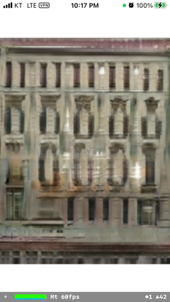
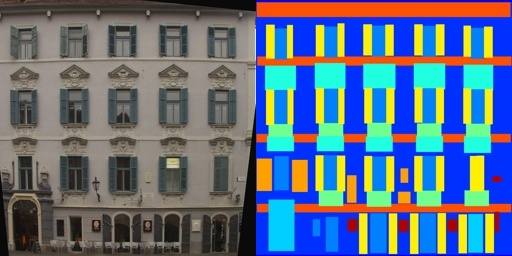

# mppb-ios-facades



MediaPipe graph that runs pix2pix variant with TensorFlow Lite on GPU.


> Try the model yourself. Place your device in front of the display and aim the condition image to the right.

Real-time implementation of cGAN (pix2pix) application. Performs image-to-image translation against the input image and generates corresponding output image of building facades. This model is pre-trained on the [CMP Facade Database](http://cmp.felk.cvut.cz/%7Etylecr1/facade/) and employs a modified (MobileNet-like) version of the pix2pix backend designed for mobile runtime. The goal was to develop an acceleratable GAN model that could be run at an interactive rate on the mobile device using the Tensorflow Lite GPU Delegate.

The optimization strategies include: 
- MobileNet-like convolution bodies
- Hand-picked operations opted for [TensorFlow Lite GPU Delegate](https://github.com/tensorflow/tensorflow/blob/4fe875c71d97e84bb380539fb64179d01deb4f15/tensorflow/lite/delegates/gpu/common/operations.h#L36-L110)
- Relaxed U-Net skip connections

Thanks to purged trainable weights and lowered computation cost, this model runs in real-time (30 frames per second or more) on both the CPU and GPU at the cost of minimal accuracy loss.

You know what? Even the TensorFlow Lite [Model Analyzer](https://www.tensorflow.org/lite/guide/model_analyzer) Approves! 😇
```
Your model looks compatible with GPU delegate with TFLite runtime version 2.11.0.
But it doesn't guarantee that your model works well with GPU delegate.
There could be some runtime incompatibililty happen.
---------------------------------------------------------------
Your TFLite model has '1' signature_def(s).

Signature#0 key: 'serving_default'
- Subgraph: Subgraph#0
- Inputs: 
    'input_1' : T#0
- Outputs: 
    'sequential_17' : T#116

---------------------------------------------------------------
              Model size:   14163092 bytes
    Non-data buffer size:      22040 bytes (00.16 %)
  Total data buffer size:   14141052 bytes (99.84 %)
    (Zero value buffers):       7948 bytes (00.06 %)
```

https://user-images.githubusercontent.com/46559594/213705956-64995f8f-b238-4c3d-a118-6f32bdecee05.mp4
