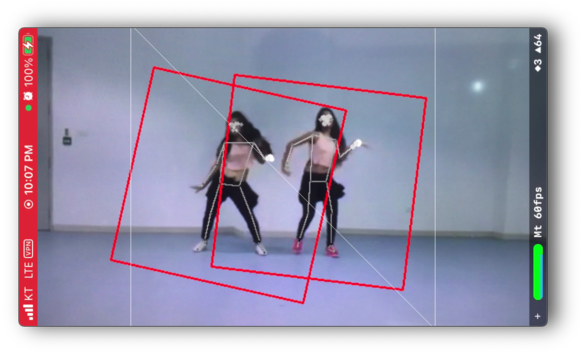

# mppb-ios-multipose

MediaPipe graph that performs multiple instances of pose tracking 
with TensorFlow Lite on GPU.

NOTE: Please do note this is not an intended use case of the pose landmarks model. As stated by @ivan-grishchenko, this graph does not guarantee the same quality as the original implementation. I gave it a little more generous IOU threshold for the non-maximum suppression calculator and performed landmarks prediction on each cropped image.

See: https://github.com/google/mediapipe/issues/1691#issuecomment-797159603

It is required that "pose_detection.tflite" and "pose_landmark_{lite|full|heavy}.tflite" are available at "mediapipe/modules/pose_detection/pose_detection.tflite" and "mediapipe/modules/pose_landmark/pose_landmark_{lite|full|heavy}.tflite" path respectively during execution.

https://user-images.githubusercontent.com/46559594/210370353-e8fedd6b-8e21-4047-8378-1008d8f4ada5.mp4
